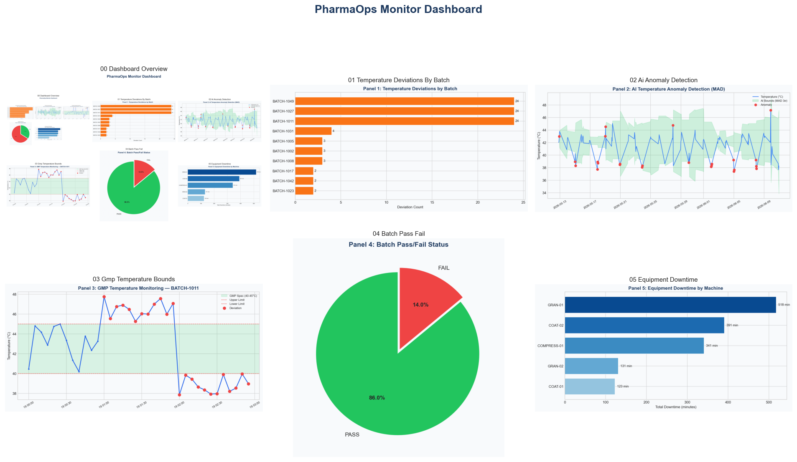
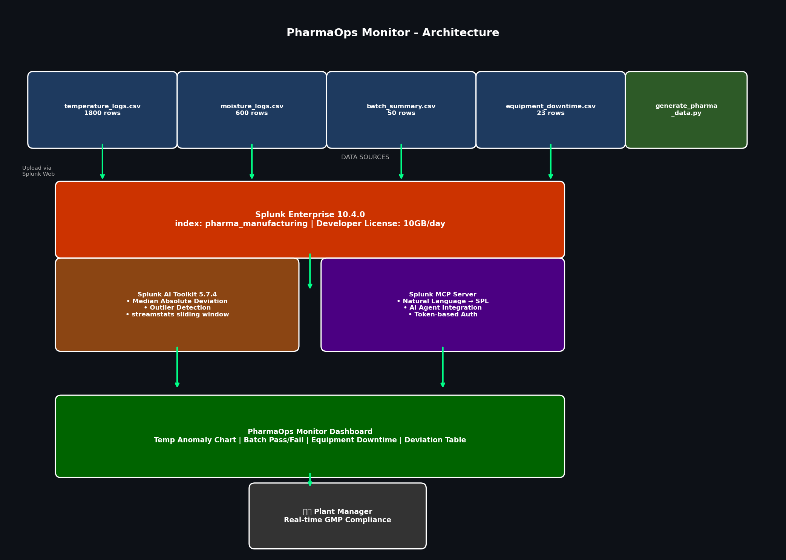

# PharmaOps Monitor

> End-to-end AI agent on Splunk that detects GMP deviations, investigates root causes autonomously, and generates FDA-compliant reports — preventing ₹50L+ batch failures in real time.

[](https://splunk.devpost.com/)
[](https://splunk.devpost.com/)
[](LICENSE)



## What This Does

PharmaOps Monitor is a **3-agent autonomous GMP compliance system** on Splunk:

```
Detection Agent → Investigation Agent → QA Review Agent → FDA Report → Alert
```

| Agent | Role |
|---|---|
| **Detection Agent** | Scans Splunk for temperature/moisture GMP anomalies (MAD/MLTK) |
| **Investigation Agent** | Multi-source evidence + Gemini root cause + CAPA |
| **QA Review Agent** | FDA 21 CFR + **ICH Q7/Q8/Q9/Q10** compliance validation + approve/reject |
| **Regulatory Intelligence** | **GMP score** + **QMS risk** + **PV assessment** + unified HTML report |

| Layer | Component |
|---|---|
| **Data** | FDA-aligned manufacturing logs (consistent across all sources) |
| **Detection** | Splunk AI Toolkit MAD + saved alert (`splunk/alerts/`) |
| **Agents** | 3-agent system via Splunk MCP + REST + Gemini |
| **Output** | FDA HTML reports + financial impact + alert log |
| **UI** | Streamlit command center + CLI + NL chat + watchdog auto-trigger |

## Architecture



## Quick Start (10 minutes)

### 1. Install

```bash
git clone https://github.com/prakash023-hub/pharmaops-monitor.git
cd pharmaops-monitor
python3 -m venv .venv && source .venv/bin/activate
pip install -r requirements.txt
export GEMINI_API_KEY=your_key
```

### 2. Generate data (FDA-aligned, consistent across all sources)

```bash
python3 generate_pharma_data.py
```

### 3. Splunk setup (app + data + dashboards — one command)

```bash
chmod +x scripts/splunk_full_setup.sh
./scripts/splunk_full_setup.sh
```

This installs the PharmaOps Splunk app (CSV field extraction), restarts Splunk, ingests data, and installs dashboards.

Open: http://localhost:8000/en-US/app/search/pharmaops_monitor (time range: **All time**)

Classic dashboard: http://localhost:8000/en-US/app/search/pharmaops_classic

Verify: `./scripts/verify_splunk.sh` — expect BATCH-1027 = **24** deviations

### 5. Configure Splunk access

```bash
echo "your_mcp_token" > ~/mcp_token.txt
export SPLUNK_PASS=your_splunk_password   # default: Splunk@23
```

### 6. Run multi-agent demo

```bash
chmod +x setup.sh run_demo.sh
./setup.sh          # one-command judge setup
./run_demo.sh       # full multi-agent demo
```

Or step by step:

```bash
python3 agent/pharma_agent.py --health
python3 agent/pharma_agent.py --multi-agent --open-report   # 3-agent pipeline
python3 agent/watchdog.py --once                            # auto-trigger
streamlit run app/streamlit_app.py                          # web command center
```

## Regulatory Framework

Every deviation is automatically mapped to:

| Standard | Guidelines |
|---|---|
| **ICH** | Q1A (Stability), Q2 (Analytical), Q7 (GMP APIs), Q8 (CQAs), Q9 (Risk Mgmt), Q10 (Quality System), Q11 (Drug Substances) |
| **FDA** | 21 CFR Part 211 — §211.100, §211.110, §211.192, §211.68 |

ICH Q9 Risk Priority Number (RPN) calculated for every investigation.

## Regulatory Intelligence (GMP + QMS + PV)

One command generates a **judge-ready regulatory report** with industry comparison:

```bash
python3 scripts/run_regulatory_demo.py --open
```

| Score | What it measures | Framework |
|---|---|---|
| **GMP Score** (0–100) | 6 pillars: documentation, process control, deviation mgmt, equipment, oversight, batch release | WHO + EU GMP + FDA 21 CFR 211 |
| **QMS Risk** (0–100) | Process performance, CAPA, change control, supplier quality, data integrity, management oversight | ICH Q10 |
| **PV Risk** (0–100) | Patient safety impact, reportability, PV team action | ICH E2E / WHO PV |
| **ICH Q9 RPN** | Severity × Occurrence × Detectability | ICH Q9 |

**Demo case BATCH-1027** (Amlodipine 5mg, coating thermostat drift):
- GMP 70.7/100 (B — Minor Gaps) — batch release blocked at 0/100
- QMS Risk 43/100 (MEDIUM) — CAPA effectiveness gap flagged
- PV Risk 100/100 (CRITICAL) — report to PV team immediately
- **99.8% faster detection** vs manual (PDA TR-59 baseline: 4 hours → 30 sec)

See `docs/INDUSTRY_IMPACT_STUDY.md` for manual vs AI comparison.

## Agent Pipeline

```
[STEP 0] Health check — MCP / Splunk REST / CSV / Gemini
[STEP 1] Autonomous detection — finds worst batch (no hardcoding)
[STEP 2] Evidence collection — temperature, QC, moisture, downtime
[STEP 3] Gemini reasoning — root cause, GMP impact, CAPA
[STEP 4] FDA HTML report — opens in browser
[STEP 5] Alert logged — agent/reports/alerts.jsonl
```

## Data (FDA-Aligned Synthetic)

Modeled on real GMP parameters:
- **Coating temperature:** 40-45°C (oral solid dosage, USP ranges)
- **Granulation moisture:** 2-4% (standard pharma spec)
- **Products:** Metformin, Amlodipine, Atorvastatin, Paracetamol, Azithromycin
- **Failure batches:** BATCH-1027, BATCH-1011, BATCH-1049 (coating thermostat drift)

| File | Rows | Description |
|---|---|---|
| temperature_logs.csv | 1,800 | Coating temp every 5 min |
| moisture_logs.csv | 600 | Granulation moisture every 10 min |
| batch_summary.csv | 50 | Yield, OEE, pass/fail |
| equipment_downtime.csv | 18 | Downtime with severity |

**One product per batch across ALL files** — no data inconsistencies.

## Project Structure

```
pharmaops-monitor/
├── agent/
│   ├── orchestrator.py       # End-to-end AI agent pipeline
│   ├── pharma_agent.py       # CLI entry point
│   ├── mcp_chat_demo.py      # Natural language interface
│   ├── splunk_mcp.py         # MCP → REST → CSV data layer
│   ├── generate_report_html.py
│   ├── gmp_scorer.py         # GMP compliance score 0–100
│   ├── qms_risk.py           # ICH Q10 QMS risk score
│   ├── pv_assessment.py      # Pharmacovigilance risk
│   ├── regulatory_report.py  # Unified regulatory HTML report
│   ├── ich_guidelines.py     # ICH Q1–Q11 + FDA mapping
│   └── reports/              # JSON + HTML + regulatory reports
├── app/
│   └── streamlit_app.py      # Plant manager web console
├── splunk/
│   ├── dashboards/pharmaops_monitor.xml
│   └── *.spl                 # Saved SPL queries
├── scripts/
│   ├── ingest_to_splunk.sh
│   └── generate_dashboard_previews.py
└── docs/
    ├── dashboard/            # Dashboard screenshots
    ├── GRAND_PRIZE_VIDEO_SCRIPT.md
    └── DEVPOST_SUBMISSION.md
```

## Splunk Data Layer

The agent tries data sources in order:
1. **Splunk MCP Server** (preferred — Best Use of MCP prize)
2. **Splunk REST API** (fallback when MCP unavailable)
3. **Local CSV** (offline demo for judges)

## Hackathon

- **Track:** Observability
- **Bonus:** Best Use of Splunk MCP Server, Best Use of Splunk Hosted Models
- **Video script:** [docs/GRAND_PRIZE_VIDEO_SCRIPT.md](docs/GRAND_PRIZE_VIDEO_SCRIPT.md)
- **Devpost:** [docs/DEVPOST_SUBMISSION.md](docs/DEVPOST_SUBMISSION.md)

## Author

**Prakash Raj K** — Sri Balaji Vidyapeeth, Puducherry, India

## License

MIT
